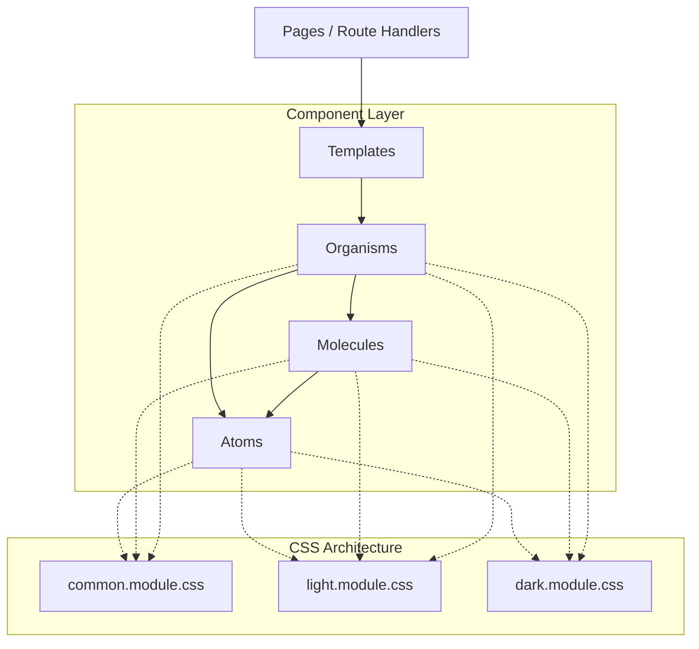

# MegiLance Frontend Architecture: Atomic Design System

## Overview

The MegiLance frontend utilizes Next.js 16 with React 19, structured around strict Atomic Design principles. This architectural pattern ensures maximum reusability, scalability, and maintainability across the platform.

Crucially, every component at every level of the atomic hierarchy strictly adheres to the **3-file CSS module system**, separating structural layout from light and dark theme design tokens.

## Atomic Hierarchy

The `frontend/app/components/` directory is organized into the following levels:

### 1. Atoms \`frontend/app/components/atoms/\`
The foundational building blocks of the interface. These components cannot be broken down any further without losing functionality.
- **Examples:** `Button`, `Input`, `Avatar`, `Badge`, `Icon`, `Typography`.
- **Responsibility:** Highly reusable, pure presentational components.

### 2. Molecules \`frontend/app/components/molecules/\`
Groups of atoms bonded together to form relatively simple, functional UI groups.
- **Examples:** `SearchInput` (Input + Button/Icon), `FormField` (Label + Input + ErrorText), `UserProfileCard` (Avatar + Typography).
- **Responsibility:** Single-responsibility functional groupings.

### 3. Organisms \`frontend/app/components/organisms/\`
Relatively complex UI components comprised of groups of molecules and/or atoms. They form distinct sections of an interface.
- **Examples:** `Header`, `Footer`, `ProjectCard`, `ProposalForm`, `SidebarNavigation`.
- **Responsibility:** Context-aware, often stateful (or receiving state from templates), representing functional zones.

### 4. Templates \`frontend/app/components/templates/\`
Page-level objects that place components into a layout and articulate the design's underlying content structure.
- **Examples:** `DashboardLayout`, `AuthLayout`, `ProjectDetailsTemplate`.
- **Responsibility:** Determining the grid and layout of organisms, acting as the skeletal structure for pages.

## Component Contract & File Structure

Every component, regardless of its atomic level, follows the exact same contract.

### The 3-File CSS Module System

For a component named `ExampleComponent`, the file structure must be:

```text
ExampleComponent/
├── ExampleComponent.tsx
├── ExampleComponent.common.module.css  # Layout, structure, spacing, animations
├── ExampleComponent.light.module.css   # Light theme colors, shadows, borders
└── ExampleComponent.dark.module.css    # Dark theme colors, shadows, borders
```

### Component Implementation Pattern

```tsx
// @AI-HINT: [Brief description of the component's purpose]
import React from 'react';
import { useTheme } from 'next-themes';
import { cn } from '@/lib/utils';
import commonStyles from './ExampleComponent.common.module.css';
import lightStyles from './ExampleComponent.light.module.css';
import darkStyles from './ExampleComponent.dark.module.css';

export interface ExampleComponentProps extends React.HTMLAttributes<HTMLDivElement> {
  // Props definition
}

export const ExampleComponent: React.FC<ExampleComponentProps> = ({ className, ...props }) => {
  const { resolvedTheme } = useTheme();

  // Prevent flash during hydration
  if (!resolvedTheme) return null;

  const themeStyles = resolvedTheme === 'light' ? lightStyles : darkStyles;

  return (
    <div 
      className={cn(commonStyles.container, themeStyles.container, className)}
      {...props}
    >
      {/* Component content */}
    </div>
  );
};
```

## Architectural Flow Diagram



## Quality and Verification

When developing new components, the following conditions must be met:
1. **No Global Styles:** All styling must be scoped within the 3 CSS files. Utility classes (Tailwind) are not the primary styling method unless explicitly integrated via the `cn()` utility.
2. **Accessibility:** Proper `aria-` labels and roles must be implemented at the component level.
3. **Theme Testing:** The component must be visually verified in both light and dark modes to ensure color contrast and readability.
